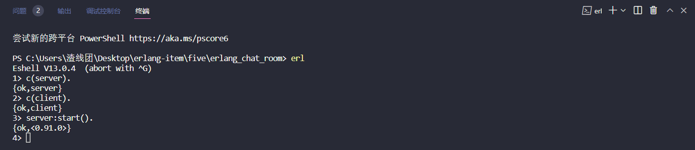
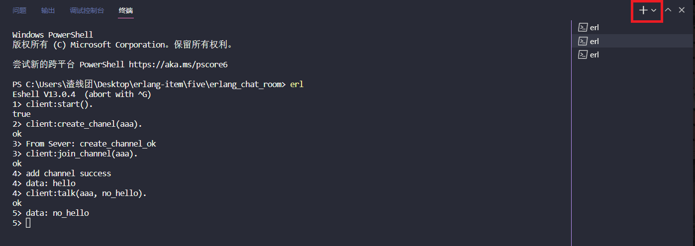
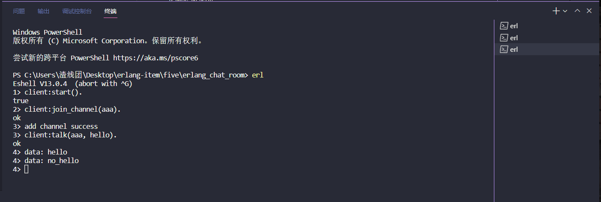

# erlang_chat_room

项目描述：基于tcp协议，使用erlang语言的gen_server行为模式搭建的多人聊天系统

功能体现：每个客户端都可以开启独立进程，一个客户端就是一个用户，服务端使用ets表管理所有用户和频道，支持用户创建多个频道（聊天室），不同用户间可以加入同个频道使用聊天室功能，支持频道退出，查看频道列表，查看频道内用户列表

环境搭建：官网 https://www.erlang.org/downloads 找到对应的系统包下载安装

路径设置：以win10为例，打开环境变量操作框，在系统变量内双击Path，新增路径 `D:\myDev\Erlang OTP\bin` 保存，这里我的 erlang 安装在了D盘目录下所以需要设置

使用示例：

一、打开该项目，使用编译器终端或者 shift+鼠标右键 打开 Powershell窗口，键入 erl 回车

二、编译文件 + 服务端开启

三、客户端开启，可以开启多个客户端

